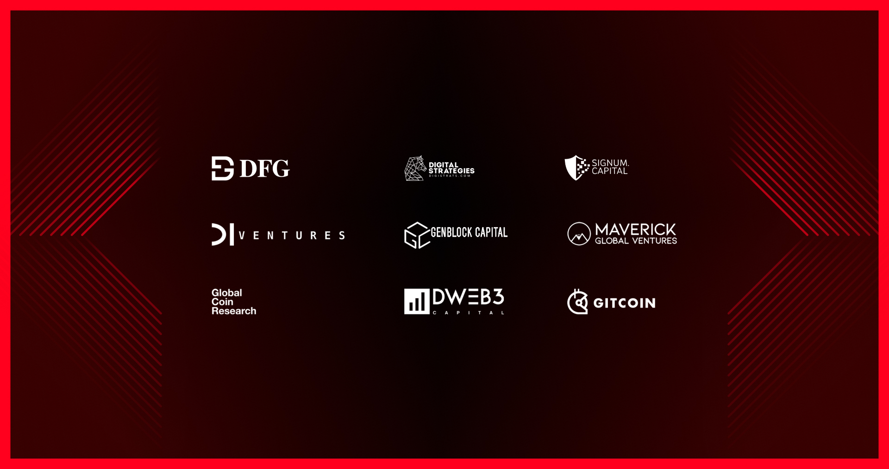

# Team & Backers

## Team and Advisors

The Ruby Protocol team consists of seasoned engineers, cryptographers, data scientists, and cryptocurrency early adopters. Our team has a profound understanding of cryptographic encryption and zero-knowledge algorithms and the expertise in cryptography has allowed us to deliver impressive results.&#x20;

The background of the team consists of both engineering and academic backgrounds from Concordium, Beam, Harvard, Suterusu, Credit Suisse, Nasdaq, John Hopkins, Ocean, UCL, Waves.

<figure><figcaption></figcaption></figure>

## Key Backers

Ruby Protocol, a privacy-centric protocol for web3, has successfully closed the $7.3 million seed funding round, which was contributed by some of the most active and renowned names in this community. This will fuel the exponential growth of Ruby Protocol and become the essential driver and indicator of future success in our endeavors to make Web3 privacy possible everywhere.

Our proud backers are DFG, Digital Strategies, SigNum Capital, D1 Ventures, GenBlock, Maverick, Global Ventures, Global Coin Research, DWeb3, Gitcoin.

<figure><figcaption></figcaption></figure>
