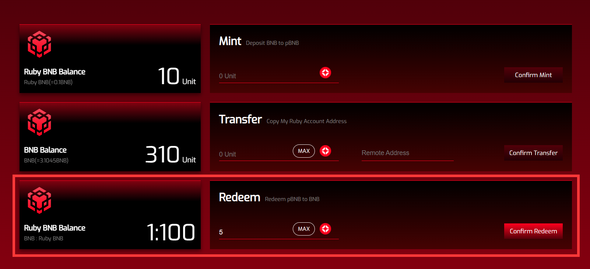

# Test Tokens & Faucets

Ruby Connect is now running on the optimism goerli network, so the premise to experience it is possessing corresponding tokens.

## Bridging to Optimism Goerli

To get the test token for ruby testnet, you are recommend bridging tokens from goerli to optimism goerli via [https://app.optimism.io/bridge](https://app.optimism.io/bridge).&#x20;

1.  switch network in metamask\

    <figure><figcaption></figcaption></figure>
2. make sure the source network is switched to Goerli

<figure><figcaption></figcaption></figure>

Then you can deposit any amount you would like to.

## Goerli Faucet

If you do not have any goerliETH yet, we recommend getting Goerli ETH from Alchemy's faucet [<mark style="color:red;">here</mark>](https://goerlifaucet.com/?a=818c11a8da).
