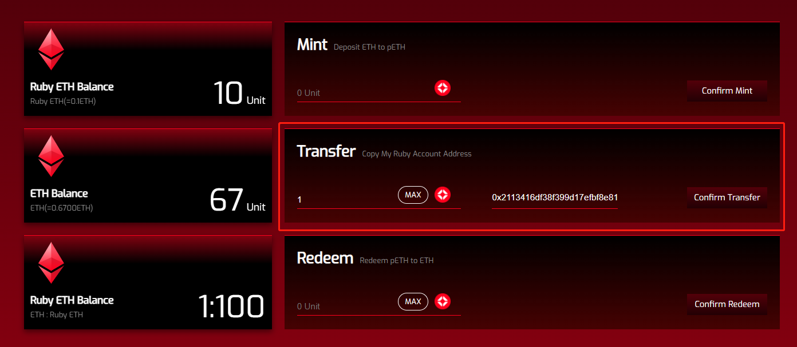

# Transfer Privacy Tokens

#### Transfer Privacy Tokens 

* Select the token you wish to transfer privately.
* Input your private key and log into your Ruby Account.
* Enter the amount and the receiver's Public Ruby Address to transfer the tokens.
* Click "Confirm Transfer" to complete the privacy token transfer.

<figure><figcaption></figcaption></figure>
